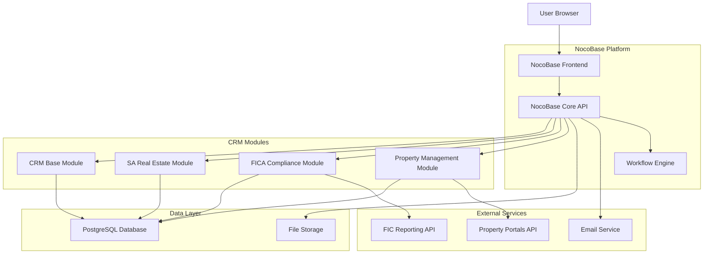
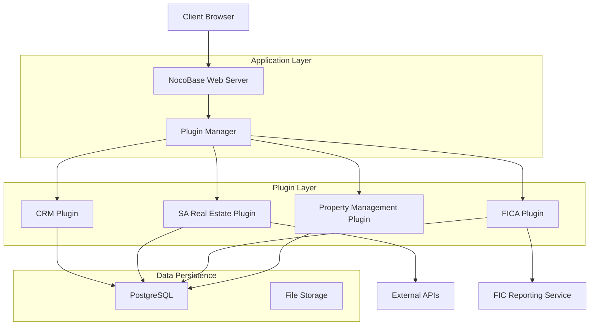
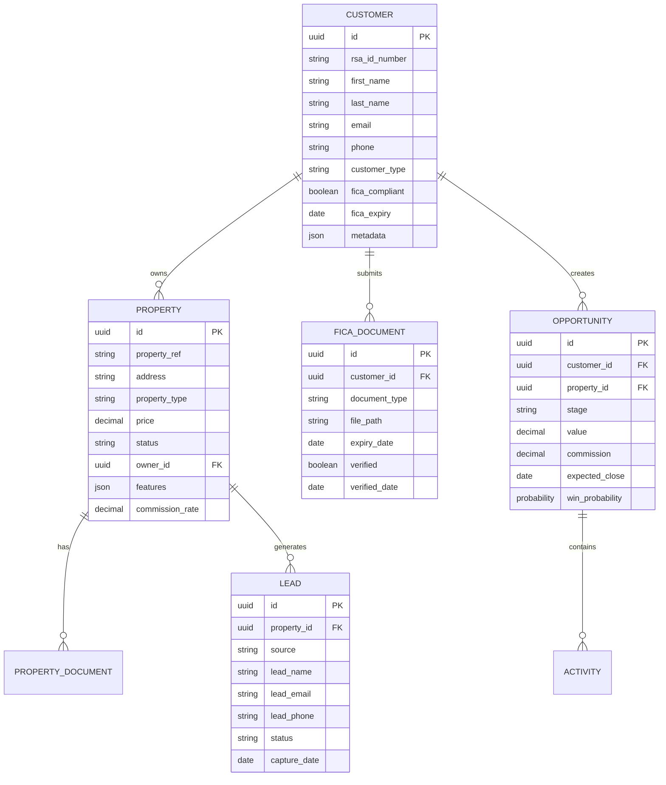

# South African Real Estate CRM Architecture

## 1. Architecture Design



## 2. Technology Description

- **Platform**: NocoBase 2.0 (Open-source no-code/low-code platform)
- **Database**: PostgreSQL (included with NocoBase)
- **File Storage**: Local/Cloud storage (configurable)
- **Email Service**: SMTP integration (Gmail, Outlook, etc.)
- **Frontend**: React-based NocoBase UI framework
- **Backend**: Node.js with Koa framework
- **Plugin System**: Microkernel architecture for extensibility

## 3. Route Definitions

| Route | Purpose |
|-------|---------|
| /admin | Main admin dashboard |
| /admin/crm/contacts | Contact management |
| /admin/crm/customers | Customer management |
| /admin/crm/opportunities | Sales opportunities |
| /admin/realestate/properties | Property listings management |
| /admin/realestate/leads | Real estate leads |
| /admin/compliance/fica | FICA compliance dashboard |
| /admin/compliance/documents | Compliance document storage |
| /admin/reports | Business intelligence reports |
| /admin/workflows | Workflow automation |

## 4. API Definitions

### 4.1 Core CRM APIs

**Customer Management**
```
GET /api/customers
POST /api/customers
PUT /api/customers/:id
DELETE /api/customers/:id
```

**Property Management**
```
GET /api/properties
POST /api/properties
PUT /api/properties/:id
GET /api/properties/:id/documents
```

**FICA Compliance**
```
POST /api/fica/verify-id
POST /api/fica/submit-documents
GET /api/fica/status/:customerId
POST /api/fica/generate-report
```

### 4.2 Property Portal Integration

**Lead Capture**
```
POST /api/webhooks/property24
POST /api/webhooks/privateproperty
POST /api/webhooks/lead-capture
```

### 4.3 FIC Reporting API

**Suspicious Activity Report**
```
POST /api/fic/report-suspicious-activity
GET /api/fic/compliance-status
POST /api/fic/submit-rmcp
```

## 5. Server Architecture Diagram



## 6. Data Model

### 6.1 Data Model Definition



### 6.2 Data Definition Language

**Customers Table**
```sql
CREATE TABLE customers (
    id UUID PRIMARY KEY DEFAULT gen_random_uuid(),
    rsa_id_number VARCHAR(13) UNIQUE,
    first_name VARCHAR(100) NOT NULL,
    last_name VARCHAR(100) NOT NULL,
    email VARCHAR(255) UNIQUE NOT NULL,
    phone VARCHAR(20),
    customer_type VARCHAR(50) DEFAULT 'individual',
    fica_compliant BOOLEAN DEFAULT FALSE,
    fica_expiry DATE,
    metadata JSONB DEFAULT '{}',
    created_at TIMESTAMP WITH TIME ZONE DEFAULT NOW(),
    updated_at TIMESTAMP WITH TIME ZONE DEFAULT NOW()
);

CREATE INDEX idx_customers_rsa_id ON customers(rsa_id_number);
CREATE INDEX idx_customers_email ON customers(email);
CREATE INDEX idx_customers_fica_status ON customers(fica_compliant);
```

**Properties Table**
```sql
CREATE TABLE properties (
    id UUID PRIMARY KEY DEFAULT gen_random_uuid(),
    property_ref VARCHAR(50) UNIQUE NOT NULL,
    address TEXT NOT NULL,
    property_type VARCHAR(50) NOT NULL,
    price DECIMAL(15,2) NOT NULL,
    status VARCHAR(50) DEFAULT 'available',
    owner_id UUID REFERENCES customers(id),
    features JSONB DEFAULT '{}',
    commission_rate DECIMAL(5,2) DEFAULT 5.0,
    created_at TIMESTAMP WITH TIME ZONE DEFAULT NOW(),
    updated_at TIMESTAMP WITH TIME ZONE DEFAULT NOW()
);

CREATE INDEX idx_properties_ref ON properties(property_ref);
CREATE INDEX idx_properties_status ON properties(status);
CREATE INDEX idx_properties_owner ON properties(owner_id);
```

**FICA Documents Table**
```sql
CREATE TABLE fica_documents (
    id UUID PRIMARY KEY DEFAULT gen_random_uuid(),
    customer_id UUID REFERENCES customers(id) ON DELETE CASCADE,
    document_type VARCHAR(50) NOT NULL,
    file_path TEXT NOT NULL,
    expiry_date DATE,
    verified BOOLEAN DEFAULT FALSE,
    verified_date TIMESTAMP WITH TIME ZONE,
    uploaded_at TIMESTAMP WITH TIME ZONE DEFAULT NOW()
);

CREATE INDEX idx_fica_customer ON fica_documents(customer_id);
CREATE INDEX idx_fica_type ON fica_documents(document_type);
CREATE INDEX idx_fica_verified ON fica_documents(verified);
```

**Compliance Audit Trail**
```sql
CREATE TABLE compliance_audit (
    id UUID PRIMARY KEY DEFAULT gen_random_uuid(),
    customer_id UUID REFERENCES customers(id),
    action_type VARCHAR(50) NOT NULL,
    action_description TEXT,
    performed_by UUID,
    action_timestamp TIMESTAMP WITH TIME ZONE DEFAULT NOW(),
    metadata JSONB DEFAULT '{}'
);

CREATE INDEX idx_audit_customer ON compliance_audit(customer_id);
CREATE INDEX idx_audit_timestamp ON compliance_audit(action_timestamp);
```

## 7. Deployment Strategy

### 7.1 One-Click Deployment Process

1. **Environment Setup**
   - Docker containerization
   - PostgreSQL database initialization
   - File storage configuration
   - Email service setup

2. **Module Installation**
   - Base CRM module activation
   - SA Real Estate module plugin
   - FICA compliance module
   - Property management module

3. **Configuration Steps**
   - RSA ID validation setup
   - FICA document templates
   - Property portal API keys
   - Workflow automation rules

4. **Data Migration** (if applicable)
   - Customer data import
   - Property listings import
   - Historical transaction data

### 7.2 Production Environment

```yaml
# docker-compose.yml
version: '3.8'
services:
  nocobase:
    image: nocobase/nocobase:latest
    ports:
      - "13000:13000"
    environment:
      - DB_DIALECT=postgres
      - DB_HOST=postgres
      - DB_PORT=5432
      - DB_DATABASE=nocobase
      - DB_USER=nocobase
      - DB_PASSWORD=password
    depends_on:
      - postgres
      
  postgres:
    image: postgres:14
    environment:
      - POSTGRES_DB=nocobase
      - POSTGRES_USER=nocobase
      - POSTGRES_PASSWORD=password
    volumes:
      - postgres_data:/var/lib/postgresql/data
      
volumes:
  postgres_data:
```

## 8. Security Considerations

- **RSA ID Validation**: Integration with Home Affairs verification API
- **Document Encryption**: FICA documents encrypted at rest
- **Audit Logging**: Complete audit trail for compliance
- **Role-Based Access**: Granular permissions per user role
- **Data Protection**: POPIA compliance for customer data
- **Secure File Storage**: Encrypted file storage for sensitive documents

## 9. Integration Points

- **Property Portals**: Property24, Private Property, Gumtree
- **Email Services**: Gmail, Outlook, SMTP
- **SMS Services**: Bulk SMS providers
- **Document Verification**: Home Affairs API
- **FIC Reporting**: Direct integration with FIC reporting system
- **Accounting Systems**: QuickBooks, Xero integration ready