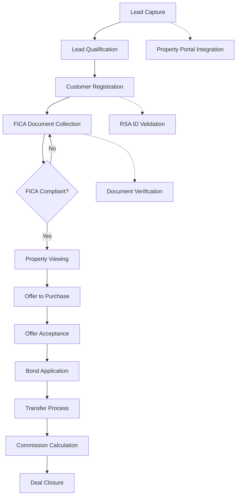
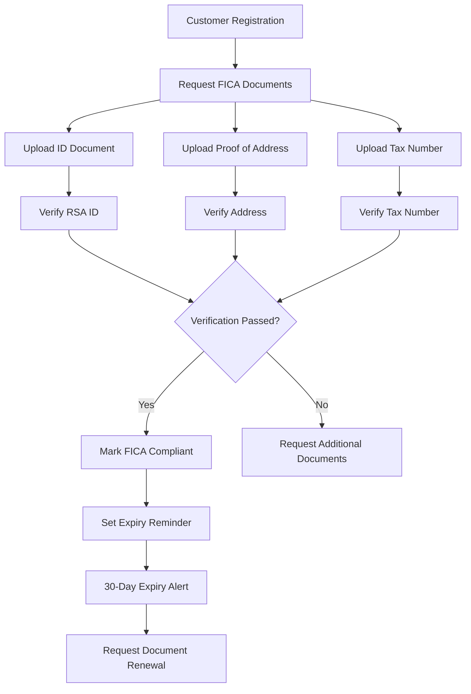

# South African Real Estate CRM Requirements Document

## 1. Product Overview

A comprehensive real estate CRM solution built on NocoBase 2.0 platform, specifically designed for South African property practitioners. The system addresses unique compliance requirements including FICA (Financial Intelligence Centre Act) regulations, RSA ID validation, and property-specific workflows while leveraging NocoBase's flexible modular architecture.

The product solves the challenge of managing scattered customer data, manual compliance processes, and disconnected property management systems by providing an integrated platform that automates workflows, ensures regulatory compliance, and streamlines real estate operations.

## 2. Core Features

### 2.1 User Roles

| Role | Registration Method | Core Permissions |
|------|---------------------|------------------|
| Property Agent | Admin invitation/registration | Manage own leads, properties, customers, view reports |
| Principal Agent | Admin assignment | Full access to all agents' data, compliance oversight, reports |
| Compliance Officer | Admin assignment | FICA verification, audit trails, compliance reporting |
| Administrator | System setup | System configuration, user management, workflow setup |
| View-Only User | Admin invitation | Read-only access to reports and dashboards |

### 2.2 Feature Module

Our South African Real Estate CRM consists of the following main modules:

1. **Dashboard**: Overview of leads, properties, sales pipeline, compliance status
2. **Customer Management**: RSA ID validated customer profiles, FICA document tracking
3. **Property Listings**: Property details, pricing, status tracking, owner management
4. **Sales Pipeline**: Lead to opportunity conversion, commission tracking
5. **FICA Compliance**: Document collection, verification, expiry alerts
6. **Reports & Analytics**: Sales performance, compliance status, lead conversion
7. **Workflow Automation**: Lead assignment, follow-up reminders, compliance checks

### 2.3 Page Details

| Page Name | Module Name | Feature description |
|-----------|-------------|---------------------|
| Dashboard | Overview Cards | Display total properties, active leads, pending FICA, monthly sales |
| Dashboard | Sales Pipeline | Visual pipeline showing opportunities by stage with conversion rates |
| Dashboard | Compliance Status | Alert panel showing expiring FICA documents and pending verifications |
| Customer List | Search & Filter | Search by name, RSA ID, phone, filter by FICA status, customer type |
| Customer List | Bulk Actions | Bulk FICA status update, document requests, assignment to agents |
| Customer Detail | Profile Information | Display RSA ID, contact details, customer type, FICA compliance status |
| Customer Detail | FICA Documents | Upload, view, verify ID documents, proof of address, tax numbers |
| Customer Detail | Property History | List of properties owned, sold, or interested in |
| Customer Detail | Communication Log | Email, phone, SMS history with automatic logging |
| Property List | Property Grid | Display property reference, address, type, price, status |
| Property List | Advanced Filter | Filter by price range, property type, location, status, owner |
| Property Detail | Basic Information | Address, type, bedrooms, bathrooms, size, features |
| Property Detail | Pricing & Status | List price, commission rate, status, listing date, expiry date |
| Property Detail | Owner Information | Link to customer profile, ownership verification |
| Property Detail | Marketing | Portal listings, photos, virtual tours, brochure generation |
| Leads Management | Lead Capture | Auto-capture from Property24, Private Property, website forms |
| Leads Management | Lead Assignment | Auto-assign based on property location, agent availability |
| Leads Management | Lead Qualification | Score leads based on budget, timeline, property preferences |
| FICA Dashboard | Document Status | Track submitted documents, verification status, expiry dates |
| FICA Dashboard | Verification Queue | List customers requiring ID verification and document review |
| FICA Dashboard | Compliance Reports | Generate FICA compliance reports for audit purposes |
| Sales Pipeline | Opportunity Stages | Customizable stages from lead to closed deal |
| Sales Pipeline | Commission Calculator | Auto-calculate commission based on sale price and rates |
| Reports Center | Sales Reports | Monthly sales, agent performance, property type analysis |
| Reports Center | Compliance Reports | FICA compliance rate, document expiry, audit trail |
| Reports Center | Lead Analytics | Lead source performance, conversion rates, time to close |
| Settings | User Management | Create users, assign roles, set permissions |
| Settings | Workflow Rules | Set up automated lead assignment, follow-up reminders |
| Settings | Integration Config | Configure property portal APIs, email, SMS services |

## 3. Core Process

### Property Sales Process Flow

### FICA Compliance Process

### User Workflows by Role

**Property Agent Workflow:**
1. Log into dashboard to view assigned leads
2. Qualify leads through phone calls and property preferences
3. Register qualified customers with RSA ID validation
4. Request and collect FICA documents
5. Schedule property viewings for compliant customers
6. Manage offers and negotiations through opportunity pipeline
7. Track bond applications and transfer processes
8. Generate commission reports upon deal closure

**Compliance Officer Workflow:**
1. Monitor FICA dashboard for pending verifications
2. Review submitted documents for authenticity
3. Verify RSA ID numbers through integrated services
4. Approve or reject FICA applications
5. Generate compliance reports for audits
6. Track document expiry dates and send renewal notifications
7. Investigate suspicious activities and file reports when necessary

**Principal Agent Workflow:**
1. Monitor overall sales performance across all agents
2. Review compliance status and audit reports
3. Manage property listings and pricing strategies
4. Analyze lead conversion rates and source performance
5. Configure workflow automation rules
6. Generate monthly business performance reports

## 4. User Interface Design

### 4.1 Design Style

- **Primary Colors**: Professional blue (#1E40AF) for primary actions, green (#059669) for success states
- **Secondary Colors**: Gray palette for neutral elements, red (#DC2626) for alerts and warnings
- **Button Style**: Rounded corners (8px radius), clear hover states, consistent sizing
- **Typography**: Inter font family, 14px base size, clear hierarchy with H1-H6
- **Layout**: Card-based design with consistent spacing (16px grid system)
- **Icons**: Professional line icons, consistent stroke width (2px)
- **Forms**: Clean input fields with clear labels and validation feedback

### 4.2 Page Design Overview

| Page Name | Module Name | UI Elements |
|-----------|-------------|-------------|
| Dashboard | Overview Cards | Blue gradient cards with white text, icon indicators, trend arrows |
| Dashboard | Sales Pipeline | Horizontal pipeline with color-coded stages, drag-and-drop functionality |
| Dashboard | Compliance Alerts | Red alert banners with action buttons, amber warning badges |
| Customer List | Search Interface | Rounded search bar with filter dropdowns, clear button |
| Customer Detail | Profile Header | Blue header bar with customer photo, compliance status badge |
| Property List | Property Cards | White cards with property images, price badges, status indicators |
| Property Detail | Image Gallery | Responsive image carousel, thumbnail navigation |
| FICA Dashboard | Document Status | Progress bars, document type icons, verification badges |
| Reports | Charts | Clean line charts, bar graphs, pie charts with legend |

### 4.3 Responsiveness

- **Desktop-First Design**: Optimized for 1920x1080 and 1366x768 resolutions
- **Tablet Adaptation**: Responsive breakpoints at 768px and 1024px
- **Mobile Support**: Essential functions available on mobile (customer lookup, lead capture)
- **Touch Optimization**: Larger tap targets (minimum 44px) for mobile interfaces

### 4.4 Accessibility Features

- **WCAG 2.1 Compliance**: AA standard compliance
- **Keyboard Navigation**: Full keyboard accessibility for all functions
- **Screen Reader Support**: Proper ARIA labels and semantic HTML
- **Color Contrast**: Minimum 4.5:1 contrast ratio for text
- **Focus Indicators**: Clear focus states for interactive elements

## 5. Integration Requirements

### 5.1 Property Portal Integrations

- **Property24 API**: Lead capture, listing synchronization
- **Private Property API**: Lead import, property status updates
- **Gumtree Integration**: Basic lead capture functionality
- **Custom Website Forms**: Lead capture from agency websites

### 5.2 Verification Services

- **Home Affairs ID Verification**: RSA ID number validation
- **Address Verification**: South African postal code validation
- **Credit Check Integration**: Optional credit score verification

### 5.3 Communication Services

- **Email Services**: Gmail, Outlook, custom SMTP integration
- **SMS Gateway**: Bulk SMS providers (Clickatell, BulkSMS)
- **WhatsApp Business**: Optional integration for customer communication

## 6. Compliance & Security

### 6.1 FICA Compliance Features

- **Document Templates**: Pre-configured FICA document requirements
- **Expiry Tracking**: Automatic alerts for document expiry
- **Audit Trail**: Complete log of all compliance activities
- **Suspicious Activity Reporting**: Integration with FIC reporting system
- **Risk Management**: Customer risk profiling and scoring

### 6.2 POPIA Compliance

- **Data Consent Tracking**: Customer consent for data processing
- **Data Retention Policies**: Automatic data archival and deletion
- **Access Logging**: Complete access audit for customer data
- **Data Encryption**: Encryption at rest and in transit

### 6.3 Security Features

- **Role-Based Access Control**: Granular permissions per user role
- **Two-Factor Authentication**: Optional 2FA for enhanced security
- **Session Management**: Secure session handling with timeout
- **Data Backup**: Automated daily backups with recovery options
- **SSL/TLS Encryption**: HTTPS enforcement for all communications

## 7. Performance Requirements

- **Page Load Time**: Maximum 3 seconds for standard pages
- **Search Response**: Sub-second response for customer searches
- **Report Generation**: Complex reports within 10 seconds
- **Concurrent Users**: Support for 50+ concurrent users
- **Data Capacity**: Handle 100,000+ customer records efficiently

## 8. Deployment & Maintenance

### 8.1 One-Click Deployment

- **Docker Containerization**: Complete containerized deployment
- **Automated Setup**: Database initialization, module installation
- **Configuration Wizard**: Step-by-step setup process
- **Migration Tools**: Import existing customer and property data

### 8.2 Maintenance Features

- **Automated Updates**: Security patches and feature updates
- **Backup System**: Scheduled backups with retention policies
- **Monitoring Dashboard**: System health and performance monitoring
- **Log Management**: Centralized logging with error alerting